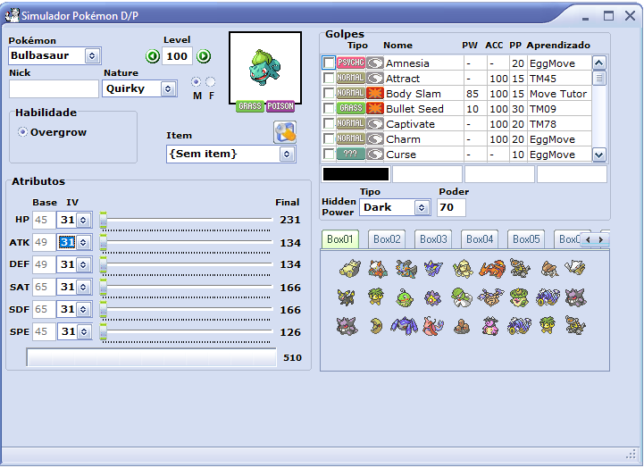

# PkmnSimulator
This is a project that I've worked at least 15 years ago, in 2005... In that time I was playing Pokémon on GameBoy and learning to code, so, after so many time, I'm here sharing the code for future contributions...

I compiled it on Borland Delphi 7, and to execute, you just have to click on PrjSimulador.exe

 

On this program you can simulate the Pokémon trainning (IVs, EVs, Nature, item) and store on your boxes.

I don't modify any file since 2009, so unfortunately we're stucked on the Diamond and Pearl generation...

